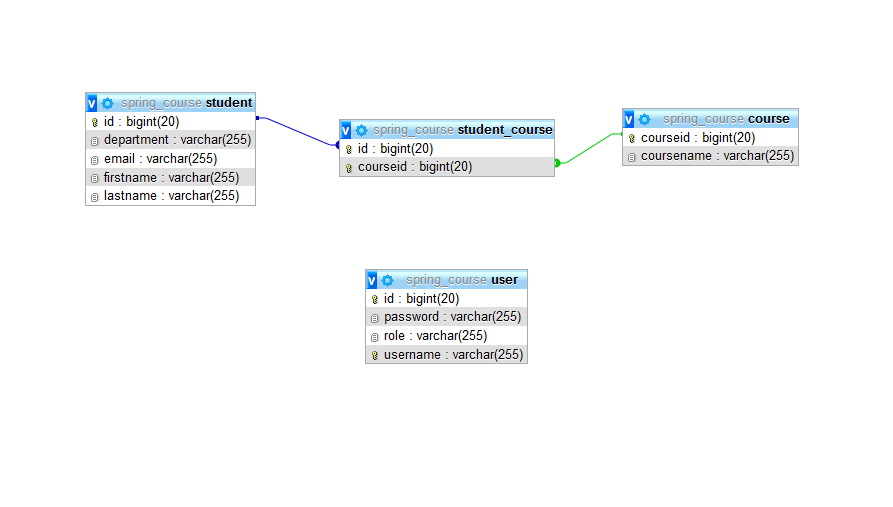

# Course

Course registration project using Java Web with Spring Framework.<br>
Spring much lighter! :)

## Features

- CRUD
- ACL
- Validation
- Login
- Responsive

## Requirements

- NetBeans 8.2
- Java JDK 1.8
- Apache Tomcat >= 9
- MySql >=5

## Tecnologies

- Java
- JPA
- Maven
- Spring
- CSS
- Bootstrap
- MySql


```

Then open the file "src/main/resources/application.properties" and enter the data according to the connection of your database. <br>

When the configuration is complete, just type in the terminal "mvn spring-boot: run" and open in your browser the following address: <br>

http://localhost:8080/

## Licence

User Registration is licensed under <a href="LICENSE">The MIT License (MIT)</a>.


<br><br>


Developed by<br>
Melaku Zeleke<br>
melakuzeleke443@gmail.com<br>

